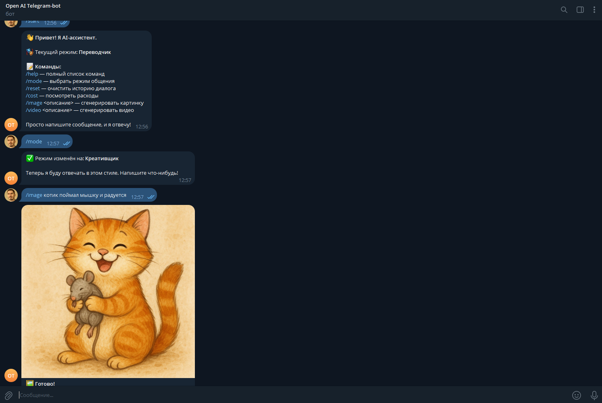

# Telegram AI Bot

Модульный Telegram-бот на Python с поддержкой OpenAI API, памяти диалога и системой расчёта стоимости запросов.

---

## 🚀 Features

- 💬 Диалог с AI (настраиваемые модели)
- 🎭 Режимы общения через `prompts.json`
- 🧠 Контекстная память
- 💾 Persistence истории
- 🖼 Генерация изображений
- 🎬 Генерация видео
- 💰 Подсчёт стоимости (USD / RUB)
- 📦 Кеширование курса валют

---

## 📸 Demo



---

## 🏗 Architecture

bot/handlers.py — команды Telegram

services/openai_client.py — работа с OpenAI API

storage/memory_store.py — память и billing

services/fx_rate.py — курс валют

config.py — конфигурация

---

## ⚙️ Installation

```bash
pip install -r requirements.txt
```
Создайте .env и скопируйте в него содержимое .env.example
Обязательны к заполнению переменные:
```env
TELEGRAM_BOT_TOKEN=your_token
OPENAI_API_KEY=your_key
```
---

## ▶️ Usage

```bash
python main.py
```

Основные команды:
/mode
/image
/video
/cost
/reset

---

## 📦 Tech Stack
Python 3.10+

aiogram

OpenAI SDK

python-dotenv

---

## 🛠 Practical Use Case
AI-ассистент в Telegram

Бот поддержки клиентов

Демонстрация интеграции AI в мессенджер

---

## 📜 License
MIT
